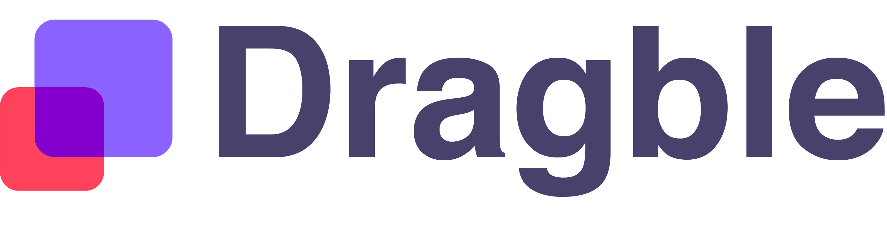

<p align="center">
  <a href="https://dragble.com">
    
  </a>
</p>

<p align="center">
  <a href="https://www.npmjs.com/package/dragble-react-editor"></a>
  <a href="https://github.com/Dragble/dragble-react-editor/blob/main/LICENSE"></a>
</p>

# dragble-react-editor

The **fully AI-powered** React editor for **email templates** and **landing pages**. Your end-users design visually with drag-and-drop — or describe what they want and watch AI agents build it live on the canvas. Powered by the built-in **Model Context Protocol (MCP)** server, connect [Claude Code](https://claude.com/code), [OpenCode](https://opencode.ai), [Codex](https://github.com/openai/codex), [Cursor](https://cursor.com), or your own AI backend directly to the editor. Structured tool calls mean guaranteed-valid output — no prompt engineering, no JSON hallucination, no broken layouts.

[Dragble](https://dragble.com) brings two design experiences together in one React component: a polished visual editor for designers and a conversational AI surface for everyone else — backed by structured tool calls that produce guaranteed-valid HTML emails and landing pages every time.

[Website](https://dragble.com) | [Documentation](https://docs.dragble.com) | [Dashboard](https://developers.dragble.com)

<p align="center">
  
</p>

## Features

- Drag-and-drop **email template builder** with 20+ content blocks
- **Fully AI-powered via MCP** — connect AI agents (Claude Code, OpenCode, Codex, Cursor) or your own AI backend to build designs live on the canvas. Structured tool calls mean guaranteed-valid output — no prompt engineering, no JSON hallucination
- Responsive **HTML email** output compatible with all major email clients
- **Newsletter editor** with merge tags, dynamic content, and display conditions
- Visual **email designer** — no HTML/CSS knowledge required for end users
- Export to HTML, JSON, image, PDF, or ZIP
- Built-in image editor, AI content generation, and collaboration tools
- Full TypeScript support
- Lightweight React wrapper — just a single component or hook

## Installation

```bash
# npm
npm install dragble-react-editor

# yarn
yarn add dragble-react-editor

# pnpm
pnpm add dragble-react-editor
```

## Editor Key

An `editorKey` is required to use the editor. You can get one by creating a project on the [Dragble Developer Dashboard](https://developers.dragble.com).

## Quick Start

```tsx
import { useRef } from "react";
import {
  DragbleEditor,
  DragbleEditorRef,
  DesignJson,
} from "dragble-react-editor";

function EmailBuilder() {
  const editorRef = useRef<DragbleEditorRef>(null);

  const handleChange = async (data: { design: DesignJson; type: string }) => {
    // Design JSON is available directly from the callback
    const json = data.design;
    console.log("Design JSON:", json);

    // To get HTML, call exportHtml on the editor
    const html = await editorRef.current?.editor?.exportHtml();
    console.log("HTML:", html);
  };

  return (
    <div style={{ height: "100vh" }}>
      <DragbleEditor
        ref={editorRef}
        editorKey="your-editor-key"
        editorMode="email"
        minHeight="600px"
        onReady={(editor) => console.log("Editor ready!")}
        onChange={handleChange}
        onError={(error) => console.error("Editor error:", error)}
      />
    </div>
  );
}
```

## Complete Example

```tsx
import { useRef, useState, useCallback } from "react";
import {
  DragbleEditor,
  DragbleEditorRef,
  DesignJson,
} from "dragble-react-editor";

function AdvancedEmailBuilder() {
  const editorRef = useRef<DragbleEditorRef>(null);
  const [isDirty, setIsDirty] = useState(false);

  const handleReady = useCallback((editor) => {
    // Set merge tags (must pass a MergeTagsConfig object)
    editor.setMergeTags({
      customMergeTags: [
        { name: "First Name", value: "{{first_name}}" },
        { name: "Last Name", value: "{{last_name}}" },
        { name: "Company", value: "{{company}}" },
      ],
      excludeDefaults: false,
      sort: true,
    });

    // Set custom fonts
    editor.setFonts({
      showDefaultFonts: true,
      customFonts: [{ label: "Brand Font", value: "BrandFont, sans-serif" }],
    });

    // Load saved design if available
    const savedDesign = localStorage.getItem("email-design");
    if (savedDesign) {
      editor.loadDesign(JSON.parse(savedDesign));
    }
  }, []);

  const handleChange = useCallback(
    (data: { design: DesignJson; type: string }) => {
      setIsDirty(true);
      localStorage.setItem("email-design", JSON.stringify(data.design));
    },
    [],
  );

  const handleExportHtml = async () => {
    const editor = editorRef.current?.editor;
    if (!editor) return;

    const html = await editor.exportHtml();
    const blob = new Blob([html], { type: "text/html" });
    const url = URL.createObjectURL(blob);
    const a = document.createElement("a");
    a.href = url;
    a.download = "email.html";
    a.click();
  };

  const handleExportImage = async () => {
    const editor = editorRef.current?.editor;
    if (!editor) return;

    const data = await editor.exportImage();
    window.open(data.url, "_blank");
  };

  return (
    <div style={{ height: "100vh", display: "flex", flexDirection: "column" }}>
      <div
        style={{
          padding: 12,
          borderBottom: "1px solid #ddd",
          display: "flex",
          gap: 8,
        }}
      >
        <button onClick={() => editorRef.current?.editor?.undo()}>Undo</button>
        <button onClick={() => editorRef.current?.editor?.redo()}>Redo</button>
        <button
          onClick={() => editorRef.current?.editor?.showPreview("desktop")}
        >
          Preview
        </button>
        <button onClick={handleExportHtml}>Export HTML</button>
        <button onClick={handleExportImage}>Export Image</button>
        {isDirty && <span style={{ color: "orange" }}>Unsaved changes</span>}
      </div>

      <DragbleEditor
        ref={editorRef}
        editorKey="your-editor-key"
        editorMode="email"
        height="100%"
        designMode="live"
        options={{
          appearance: { theme: "light" },
          features: {
            preview: true,
            undoRedo: true,
            imageEditor: true,
          },
        }}
        onReady={handleReady}
        onChange={handleChange}
        onError={(error) => console.error(error.message)}
      />
    </div>
  );
}

export default AdvancedEmailBuilder;
```

## MCP — AI Integration

Connect AI agents (Claude Code, OpenCode, Codex, Cursor, or your own backend) to the editor through the Model Context Protocol. Your backend uses `mcp_key`; third-party AI clients use `mcp_client_key` plus a pairing code. Tool calls mutate design state live on the canvas.

### Enabling MCP

MCP is on by default when your plan includes it. You can still set `features: { mcp: true }` explicitly, or set `features: { mcp: false }` to turn it off for an embed:

```tsx
<DragbleEditor
  ref={editorRef}
  editorKey="db_pxl81cxn92wignwx"
/>
```

MCP also requires a **Starter plan or higher**. Both conditions must be true — plan allows it AND SDK has not opted out.

### Quick example — your backend controls the AI

```tsx
import { useRef } from "react";
import { DragbleEditor, DragbleEditorRef } from "dragble-react-editor";

function App() {
  const editorRef = useRef<DragbleEditorRef>(null);

  const handleConnectAI = async () => {
    // The id is YOUR identifier — derive it from your own database/session
    // so the same user editing the same document always gets the same MCP
    // session. Example: if your logged-in user is "alice123" and they're
    // editing document "campaign-summer-2026", build an id like this:
    //
    //   const id = "alice123-campaign-summer-2026";
    //
    // Format rules: 8-128 chars, only letters/digits/hyphens/underscores.
    const userIdFromAuth = "alice123"; // from your auth/session
    const docIdFromRoute = "campaign-summer"; // from your URL or DB row
    const id = `${userIdFromAuth}-${docIdFromRoute}`;
    const { sessionId } = await editorRef.current!.editor!.joinMCP({ id });
    // Pass sessionId to your backend — it calls MCP tools with your backend mcp_key
  };

  return (
    <div style={{ height: "100vh" }}>
      <button onClick={handleConnectAI}>Connect AI</button>
      <DragbleEditor
        ref={editorRef}
        editorKey="db_pxl81cxn92wignwx"
      />
    </div>
  );
}
```

### Quick example — end-user pairs their own AI client

```tsx
const handleLetUserPair = async () => {
  const editor = editorRef.current!.editor!;
  // Same id you'd use anywhere else for this user+document combination.
  // 8-128 chars, only letters/digits/hyphens/underscores.
  const id = "alice123-campaign-summer-2026";
  const { code, expiresAt } = await editor.startMCPPairing({ id });
  alert(`Paste this into Claude Code: ${code}`);
};
```

### One controller per session

Each session can be controlled by **either** your backend **or** an end-user's AI client (OpenCode, Claude Code), never both at the same time:

- If your backend makes the first tool call → session is locked to **backend**. Pairing codes are rejected.
- If a user pairs via pairing code first → session is locked to **paired client**. Backend tool calls are rejected.

This prevents two AI controllers from conflicting on the same design.

### How it works

1. **Confirm MCP is enabled**: it is on by default; set `features: { mcp: false }` only when you want to opt out.
2. **Generate MCP keys** in the Dragble dashboard: use backend `mcp_key` for your server, and `mcp_client_key` for Claude/OpenCode/Cursor/Codex-style clients.
3. **Call `editor.joinMCP({ id })`** where `id` is a stable identifier you control (see below).
4. **Choose your AI path**: either your backend calls MCP tools directly (using `mcp_key`), or you generate a pairing code for the end-user to connect their own AI client (using `mcp_client_key`).
5. **Mutations stream live** onto the editor canvas as the AI works.

### The `id` parameter — why it matters

The `id` you pass to `joinMCP()` is a **Bring Your Own ID (BYOI)** that maps to your domain entities. It is NOT a random token — it is how Dragble identifies the session across browser refreshes, server restarts, and device switches.

**Rules:**

- 8–128 characters long
- Only letters, numbers, hyphens, and underscores (`a-z A-Z 0-9 - _`)
- Must be deterministic — the same user editing the same document should always produce the same `id`

**Why these rules?**

- The `id` is used in database lookups and URL paths — special characters or extreme lengths would break routing
- Same `id` = resume the same session. Random UUIDs mean every page refresh creates a new session and loses AI context
- Short IDs (< 8 chars) are too easy to guess, long IDs (> 128 chars) waste storage

```tsx
// Recommended: derive from your domain — concrete examples
editor.joinMCP({ id: "alice123-campaign-summer-2026" }); // user + doc
editor.joinMCP({ id: "workspace_acme_template_welcome" }); // workspace + template
editor.joinMCP({ id: "org-uber-eats-promo-q4-2026" }); // org + campaign
editor.joinMCP({ id: "tenant_42_invoice_template_v3" }); // tenant + entity

// Valid but NOT recommended — random IDs break session continuity
// (every page refresh creates a brand new session, AI loses context)
editor.joinMCP({ id: crypto.randomUUID() });
```

### Disconnecting

`disconnectMCP()` permanently destroys the session — the session cannot be reopened:

```tsx
const { destroyed } = await editor.disconnectMCP();
```

Your backend can also force-destroy a session server-side (e.g., when a user's subscription ends):

```bash
curl -X DELETE https://mcp.dragble.com/sessions/user-42-doc-99 \
  -H "X-API-Key: db_mcp_your_key_here"
```

Idle sessions are reaped after 2 hours of inactivity. Active sessions never expire — each tool call resets the timer.

### MCP method reference

| Method                                             | Returns                                                                 |
| -------------------------------------------------- | ----------------------------------------------------------------------- |
| `editor.joinMCP({ id, editorMode? })`              | `{ sessionId, resumed? }` for backend-managed flows                     |
| `editor.startMCPPairing({ id, editorMode? })`      | `{ sessionId, resumed?, code, expiresAt }` for client pairing           |
| `editor.disconnectMCP()`                           | `{ destroyed }` — permanently deletes session                           |
| `editor.getPairingCode()`                          | `{ code, expiresAt }` — generate a pairing code for end-user AI clients |
| `editor.endPairing()`                              | `{ revoked }` — invalidate the active pairing code                      |
| `editor.getMCPStatus()`                            | `{ paired: true, sessionId } \| { paired: false, reason? }`             |
| `editor.onAIToolFired(cb)`                         | unsubscribe fn — fires when AI calls any tool                           |

### Full documentation

- [MCP Overview](https://docs.dragble.com/mcp-server/overview)
- [Credentials & Security](https://docs.dragble.com/mcp-server/credentials)
- [AI Client Setup (OpenCode, Claude Code, Codex, etc.)](https://docs.dragble.com/mcp-server/ai-client-setup)

## Props

| Prop            | Type                                                                       | Required | Default     | Description                                                |
| --------------- | -------------------------------------------------------------------------- | -------- | ----------- | ---------------------------------------------------------- |
| `editorKey`     | `string`                                                                   | Yes      | —           | Editor key for authentication                              |
| `design`        | `DesignJson \| ModuleData \| null`                                         | No       | `undefined` | Initial design to load                                     |
| `editorMode`    | `EditorMode`                                                               | No       | —           | `"email"` \| `"web"` \| `"popup"`                          |
| `contentType`   | `"module"`                                                                 | No       | —           | Single-row module editor mode                              |
| `options`       | `EditorOptions`                                                            | No       | `{}`        | All editor configuration                                   |
| `popup`         | `PopupConfig`                                                              | No       | —           | Popup config (only when `editorMode` is `"popup"`)         |
| `collaboration` | `boolean \| CollaborationFeaturesConfig`                                   | No       | —           | Collaboration features                                     |
| `user`          | `UserInfo`                                                                 | No       | —           | User info for session/collaboration                        |
| `designMode`    | `"edit" \| "live"`                                                         | No       | `"live"`    | Template permissions mode                                  |
| `height`        | `string \| number`                                                         | No       | —           | Editor height                                              |
| `minHeight`     | `string \| number`                                                         | No       | `"600px"`   | Minimum editor height                                      |
| `callbacks`     | `Omit<DragbleCallbacks, "onReady" \| "onLoad" \| "onChange" \| "onError">` | No       | —           | SDK callbacks (excluding those handled by dedicated props) |
| `className`     | `string`                                                                   | No       | —           | CSS class for the outer container                          |
| `style`         | `React.CSSProperties`                                                      | No       | —           | Inline styles for the outer container                      |

| `onReady` | `(editor: DragbleSDK) => void` | No | — | Called when the editor is ready |
| `onLoad` | `() => void` | No | — | Called when a design is loaded |
| `onChange` | `(data: { design: DesignJson; type: string }) => void` | No | — | Called when the design changes |
| `onError` | `(error: Error) => void` | No | — | Called on error |
| `onComment` | `(action: CommentAction) => void` | No | — | Called on comment events |

## Ref

Use a ref to access the SDK instance:

```tsx
const editorRef = useRef<DragbleEditorRef>(null);

// DragbleEditorRef shape:
// {
//   editor: DragbleSDK | null;
//   isReady: () => boolean;
// }
```

## Hook API

The `useDragbleEditor` hook provides a convenient way to access the editor:

```tsx
import { DragbleEditor, useDragbleEditor } from "dragble-react-editor";

function MyEditor() {
  const { ref, editor, isReady } = useDragbleEditor();

  return (
    <div>
      <button
        onClick={async () => {
          const html = await editor?.exportHtml();
          console.log(html);
        }}
        disabled={!isReady}
      >
        Export
      </button>
      <DragbleEditor ref={ref} editorKey="your-editor-key" />
    </div>
  );
}
```

**Returns:** `{ ref, editor, isReady }` — `ref` is passed to the component, `editor` is the SDK instance (or `null`), and `isReady` is a boolean.

## SDK Methods Reference

Access the SDK via `editorRef.current?.editor` or the `editor` value from `useDragbleEditor()`. All export and getter methods return Promises.

### Design

```tsx
editor.loadDesign(design, options?);                   // void
const result = await editor.loadDesignAsync(design, options?);
// => { success, validRowsCount, invalidRowsCount, errors? }
editor.loadBlank(options?);                            // void
const { html, json } = await editor.getDesign();       // Promise
```

### Export

All export methods are **Promise-based**. There are no callback overloads.

```tsx
const html = await editor.exportHtml(options?);        // Promise<string>
const json = await editor.exportJson();                // Promise<DesignJson>
const text = await editor.exportPlainText();           // Promise<string>
const imageData = await editor.exportImage(options?);  // Promise<ExportImageData>
const pdfData = await editor.exportPdf(options?);      // Promise<ExportPdfData>
const zipData = await editor.exportZip(options?);      // Promise<ExportZipData>
const values = await editor.getPopupValues();          // Promise<PopupValues | null>
```

### Merge Tags

`setMergeTags` accepts a `MergeTagsConfig` object, not a plain array.

```tsx
editor.setMergeTags({
  customMergeTags: [
    { name: "First Name", value: "{{first_name}}" },
    { name: "Company", value: "{{company}}" },
  ],
  excludeDefaults: false,
  sort: true,
});
const tags = await editor.getMergeTags(); // Promise<(MergeTag | MergeTagGroup)[]>
```

### Special Links

`setSpecialLinks` accepts a `SpecialLinksConfig` object.

```tsx
editor.setSpecialLinks({
  customSpecialLinks: [{ name: "Unsubscribe", href: "{{unsubscribe_url}}" }],
  excludeDefaults: false,
});
const links = await editor.getSpecialLinks(); // Promise<(SpecialLink | SpecialLinkGroup)[]>
```

### Modules

```tsx
editor.setModules(modules); // void
editor.setModulesLoading(loading); // void
const modules = await editor.getModules(); // Promise<Module[]>
```

### Fonts

```tsx
editor.setFonts(config); // void
const fonts = await editor.getFonts(); // Promise<FontsConfig>
```

### Body Values

```tsx
editor.setBodyValues({
  backgroundColor: "#f5f5f5",
  contentWidth: "600px",
});
const values = await editor.getBodyValues(); // Promise<SetBodyValuesOptions>
```

### Editor Configuration

```tsx
editor.setOptions(options); // void — Partial<EditorOptions>
editor.setToolsConfig(toolsConfig); // void
editor.setEditorMode(mode); // void
editor.setEditorConfig(config); // void
const config = await editor.getEditorConfig(); // Promise<EditorBehaviorConfig>
```

### Locale, Language & Text Direction

```tsx
editor.setLocale(locale, translations?);            // void
editor.setLanguage(language);                       // void
const lang = await editor.getLanguage();            // Promise<Language | null>
editor.setTextDirection(direction);                 // void — 'ltr' | 'rtl'
const dir = await editor.getTextDirection();        // Promise<TextDirection>
```

### Appearance

```tsx
editor.setAppearance(appearance); // void
```

### Undo / Redo / Save

```tsx
editor.undo(); // void
editor.redo(); // void
const canUndo = await editor.canUndo(); // Promise<boolean>
const canRedo = await editor.canRedo(); // Promise<boolean>
editor.save(); // void
```

### Preview

```tsx
editor.showPreview(device?);  // void — 'desktop' | 'tablet' | 'mobile'
editor.hidePreview();         // void
```

### Custom Tools

```tsx
await editor.registerTool(config); // Promise<void>
await editor.unregisterTool(toolId); // Promise<void>
const tools = await editor.getTools(); // Promise<Array<{ id, label, baseToolType }>>
```

### Custom Widgets

```tsx
await editor.createWidget(config); // Promise<void>
await editor.removeWidget(widgetName); // Promise<void>
```

### Collaboration & Comments

```tsx
editor.showComment(commentId); // void
editor.openCommentPanel(rowId); // void
```

### Tabs & Branding

```tsx
editor.updateTabs(tabs); // void
editor.setBrandingColors(config); // void
editor.registerColumns(cells); // void
```

### Display Conditions

```tsx
editor.setDisplayConditions(config); // void
```

### Audit

```tsx
const result = await editor.audit(options?);  // Promise<AuditResult>
```

### Asset Management

```tsx
const { success, url, error } = await editor.uploadImage(file, options?);
const { assets, total } = await editor.listAssets(options?);
const { success, error } = await editor.deleteAsset(assetId);
const folders = await editor.listAssetFolders(parentId?);
const folder = await editor.createAssetFolder(name, parentId?);
const info = await editor.getStorageInfo();
```

### Status & Lifecycle

```tsx
editor.isReady(); // boolean
editor.destroy(); // void
```

## Events

Subscribe to editor events using `addEventListener`:

```tsx
const unsubscribe = editor.addEventListener("design:updated", (data) => {
  console.log("Design changed:", data);
});

// Or remove manually
editor.removeEventListener("design:updated", callback);
```

### Available Events

| Event                      | Description                 |
| -------------------------- | --------------------------- |
| `editor:ready`             | Editor initialized          |
| `design:loaded`            | Design loaded               |
| `design:updated`           | Design changed              |
| `design:saved`             | Design saved                |
| `row:selected`             | Row selected                |
| `row:unselected`           | Row unselected              |
| `column:selected`          | Column selected             |
| `column:unselected`        | Column unselected           |
| `content:selected`         | Content block selected      |
| `content:unselected`       | Content block unselected    |
| `content:modified`         | Content block modified      |
| `content:added`            | Content block added         |
| `content:deleted`          | Content block deleted       |
| `preview:shown`            | Preview opened              |
| `preview:hidden`           | Preview closed              |
| `image:uploaded`           | Image uploaded successfully |
| `image:error`              | Image upload error          |
| `export:html`              | HTML exported               |
| `export:plainText`         | Plain text exported         |
| `export:image`             | Image exported              |
| `save`                     | Save triggered              |
| `save:success`             | Save succeeded              |
| `save:error`               | Save failed                 |
| `template:requested`       | Template requested          |
| `element:selected`         | Element selected            |
| `element:deselected`       | Element deselected          |
| `export`                   | Export triggered            |
| `displayCondition:applied` | Display condition applied   |
| `displayCondition:removed` | Display condition removed   |
| `displayCondition:updated` | Display condition updated   |

## TypeScript

All SDK types are re-exported from the package:

```tsx
import type {
  DragbleEditorRef,
  DragbleEditorProps,
  DesignJson,
  EditorOptions,
  MergeTag,
  MergeTagGroup,
  MergeTagsConfig,
  SpecialLink,
  SpecialLinkGroup,
  SpecialLinksConfig,
  FontsConfig,
  EditorMode,
  PopupConfig,
  UserInfo,
  CollaborationFeaturesConfig,
  CommentAction,
} from "dragble-react-editor";
```

## Contributing

See [CONTRIBUTING.md](./CONTRIBUTING.md) for guidelines on how to contribute to this project.

## License

[MIT](./LICENSE)
